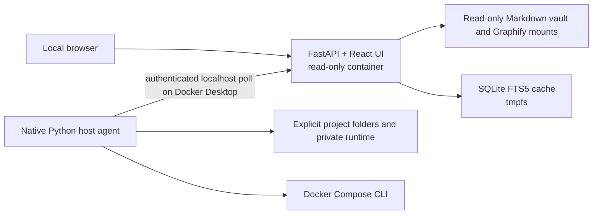

# Engineering Knowledge Hub

**Early preview · 0.1.0 · local-first**

Engineering Knowledge Hub connects what your code is with the decisions and incidents that explain how it got there. It presents Graphify code graphs and an ordinary Markdown knowledge folder in one local browser dashboard.

No account, telemetry, analytics, cloud database, or AI key is required. Your repositories, graphs, and notes stay in their own folders on your computer.

> Working name only. This project is not affiliated with Graphify or Obsidian. Both are independent, optional products owned by their respective creators. Neither is bundled here.

## Preview

The `demo/` directory contains a fictional web platform and Markdown notes for safe screenshots. Screenshot placeholders:

- Project dashboard: `docs/screenshots/project-dashboard.png`
- Knowledge and backlinks: `docs/screenshots/knowledge.png`
- Add Project flow: `docs/screenshots/add-project.png`

No private screenshots are included.

## What you can do

- Add a Git repository or ordinary source folder from the browser after host-side validation.
- Generate or update a [Graphify](https://pypi.org/project/graphifyy/) code graph on the host, then inspect it through read-only container mounts.
- Browse Markdown notes, wiki links, backlinks, related notes, and a combined deterministic SQLite FTS5 search index.
- Enable knowledge with one conservative Overview template. Existing notes are preserved.
- Prepare a prompt for an external coding agent to propose knowledge for human review. The Hub itself sends nothing to an AI provider.
- Unregister a project without deleting the repository, graph, notes, or Git history.

## Requirements

- macOS with Docker Desktop, Docker Compose, and Python 3.9 or newer; or Linux with Docker Compose and Python 3.9 or newer. Development installs require Python 3.12 or newer.
- A browser on the same computer.
- Graphify CLI is optional. If installed, it runs on the host in local code-only mode for new graphs. Non-code semantic extraction is not invoked by the Hub.
- Obsidian desktop is optional. Any Markdown directory works as a vault.

Windows has not been tested. Linux host-agent persistence uses `nohup` in this preview; configure a user service for durable restarts.

## Install

From a local clone or source checkout:

```sh
./install.sh
```

The installer copies the small application source and pinned runtime dependency list to `~/.local/share/engineering-knowledge-hub/`, builds the web image there, starts the native host agent, and prints a local access key. On macOS it registers a per-user LaunchAgent so the agent survives terminal exit. The installed copy also avoids macOS background-service access problems when the development checkout lives in Documents. Open the printed `http://127.0.0.1:8765` URL and enter that key. Choose an existing Markdown directory, or create a directory first and select it. Then click **+ Add Project**.

If port 8765 is occupied, set `HUB_PORT=8766` before running the installer. Set `HUB_DATA_DIR` to change the private runtime location or `HUB_INSTALL_DIR` to change the installed application copy. The default private runtime is `~/.engineering-knowledge-hub/`. Rerun the installer after updating the source checkout. The installer was tested with an isolated runtime and port. It does not import or modify another Hub installation.

Normal project management after installation happens in the browser. The repository path field is used because a portable native folder picker would require broader host integration.

## Daily workflow

1. Open the local Hub URL and sign in with the local access key.
2. Click **+ Add Project**, enter the absolute source folder, and review validation.
3. Choose Code Intelligence and Engineering Knowledge, then confirm.
4. Follow actual progress. The browser reconnects if the Hub restarts to add a read-only graph mount.
5. Open the project, browse notes or graph, update the graph, or use **Settings → Unregister**.

When Graphify is absent, knowledge browsing still works. When Obsidian is absent, the browser still reads Markdown normally.

## Architecture



FastAPI, Pydantic, and SQLAlchemy back the HTTP and search layers. React, TypeScript, Vite, TanStack Query, and React Router provide the browser UI. The multi-stage Docker build compiles frontend assets, which FastAPI serves. The web root filesystem is read-only, and its FTS5 index is disposable. Markdown files and Graphify outputs remain the authoritative data.

The small native agent validates paths and performs the allow-listed host operations. Docker Desktop on macOS cannot use the tested bind-mounted Unix socket, so the agent polls an authenticated localhost endpoint on the Hub. Native runs can use the Unix socket. The container never receives the Docker socket, a home-directory mount, or repository write access.

See [SECURITY.md](SECURITY.md) for the control-plane and browser threat model.

## Data locations

| Location | Contents |
|---|---|
| This source tree | Code, tests, demo, and documentation only |
| `~/.engineering-knowledge-hub/` by default | Private registry, config, generated Compose mounts, operation status, audit logs, access keys |
| Your chosen Markdown folder | Your notes, including optional Obsidian-compatible wiki links |
| Your source folders | Source and optional `graphify-out/` |

No private runtime data belongs inside this source tree. No automatic Git commit or push is made to the vault. No external CDN or update check is used.

## Backup, restore, and uninstall

Back up the private runtime directory and your Markdown folder separately. They are ordinary files; stop the Hub before copying the runtime for a consistent registry snapshot. Keep the copy access-controlled because it contains local access keys. Restore them to their original paths, then run `./install.sh` from the source checkout. Graphify outputs remain in their source folders and are not part of the Hub backup. The Hub is not a repository backup system.

Run `./uninstall.sh` to stop the Hub container and host agent. The runtime, repositories, graph outputs, and Markdown vault remain. Remove the runtime manually only after confirming a backup; the uninstall script deliberately does not delete user data.

## Development

```sh
python3 -m venv .venv
.venv/bin/pip install -e '.[test]'
.venv/bin/python -m pytest
cd frontend && npm ci && npm run build
```

Tests use synthetic temporary repositories and vaults. The Docker installer is the production build path. See [CONTRIBUTING.md](CONTRIBUTING.md).

## Limitations and roadmap

- Browser editing of Markdown is not included; edit in Obsidian or any text editor.
- Project onboarding uses a validated path field, not a native folder picker.
- The tool is single-user, local-only. Remote and LAN deployments are unsupported.
- Graphify CLI and output format compatibility may vary across versions.
- Initial knowledge scaffolding contains placeholders; it does not invent architecture history.
- Windows is untested, and Linux service startup is less mature than macOS LaunchAgent support.
- Search rebuilds its disposable FTS5 cache from mounted files as they change.

Future work: native folder selection where safe, stronger Linux service packaging, richer graph navigation, and migration tooling for older local installations.

## Contributing and license

See [CONTRIBUTING.md](CONTRIBUTING.md). The source is licensed under [MIT](LICENSE). Third-party packages retain their own licenses; see [THIRD_PARTY_NOTICES.md](THIRD_PARTY_NOTICES.md).
